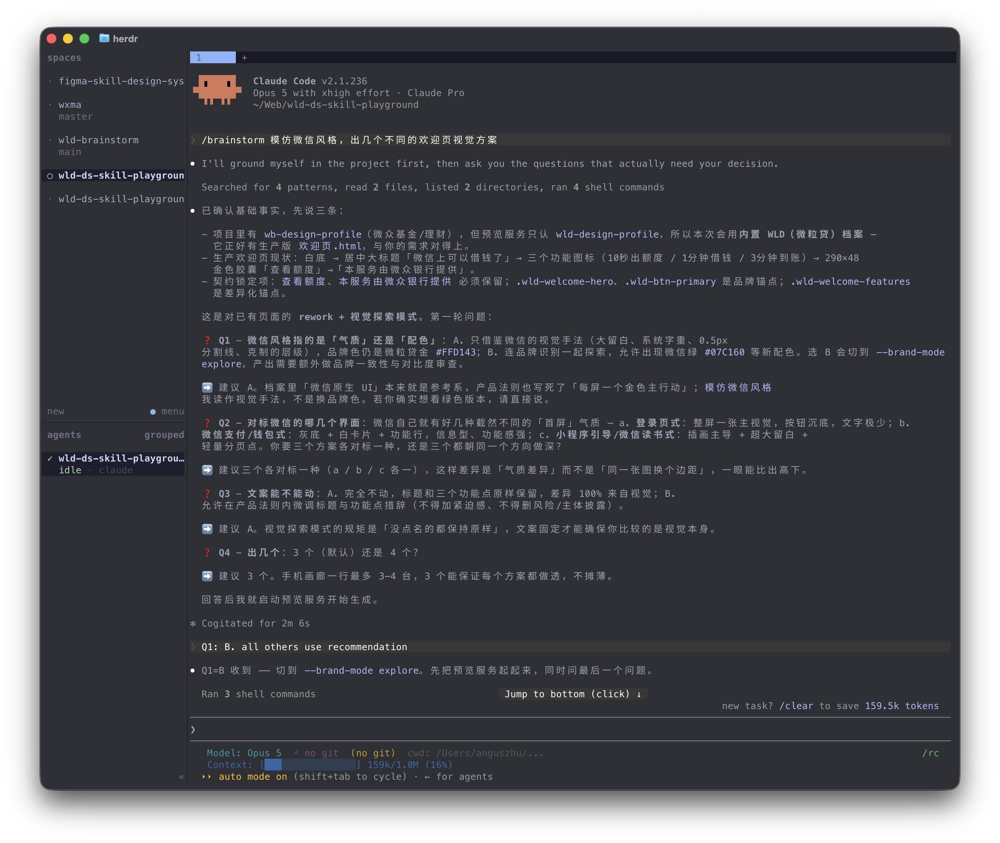
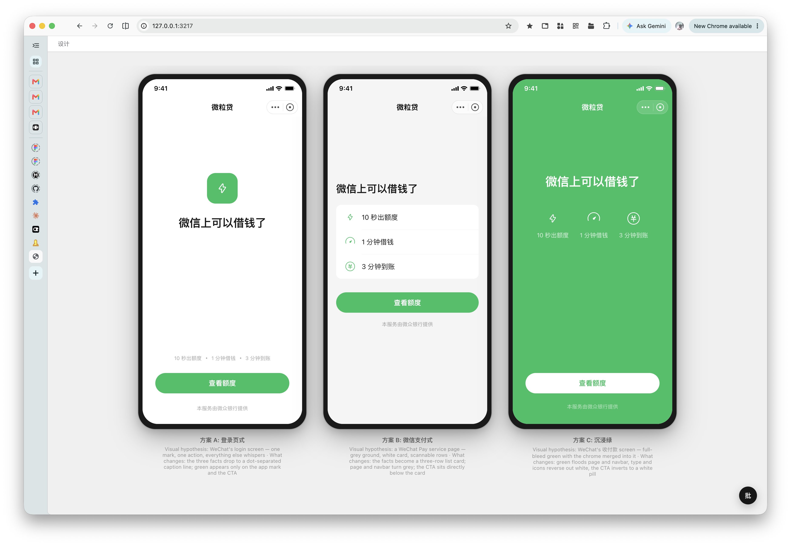

# WLD Brainstorm 插件

WLD Brainstorm 插件包含以下 Skill

| Skill | 使用场景 |
|------|--------|
| setup-profile | 需要初始化、修改、新增页面模板、设计组件、design token 等文件时使用 |
| brainstorm | 从零设计界面，或探索已有设计的其他可能性 |
| wtf | 你听不懂 AI 在说什么，让它用简明易懂的语言复述一遍 |

## 如何安装

<details>
<summary><strong>Codex Desktop</strong></summary>

1. 点击侧边栏 `Plugins`
2. 点击右上角 `Add` -> `Add a marketplace`
3. 在 Source 中输入 `angusjune/wld-brainstorm` 后确认添加
4. 添加成功后，回到 `Plugins` 页面，切换到 `Personal` Tab，安装 WLD Brainstorm Plugin 即可

</details>

<details>
<summary><strong>Codex CLI</strong></summary>

1. 在终端中运行
```bash
codex plugin marketplace add angusjune/wld-brainstorm
```

2. 进入 codex session 后运行 `/plugins` 后选择 `WLD Brainstorm` 安装

</details>

<details>
<summary><strong>Claude Code</strong></summary>

1. 在 Claude Code session 中运行
```bash
/plugin marketplace add angusjune/wld-brainstorm
```

2. 选择 `wld-brainstorm`，然后重新加载插件：
```bash
/reload-plugins
```

</details>

<details>
<summary><strong>手动安装</strong></summary>

如果你不希望使用plugin生态, 或想手动修改skill, 可直接下载repo, 直接 `skills/` 文件夹内的skill即可

</details>

## Skill 详情

### setup-profile

管理工作区的产品profile：初始化产品profile至当前目录; 根据 Figma URL、截图、现有 HTML、本地实现和文字说明等来源添加生产模板; 修改现有模板、设计语言等。

> [!TIP]
> **Profile 是什么?**
>
> Profile 是产品设计上下文，包含生产页面模板、design token和组件样式。建议在每个工作区首次使用时运行一次 `$setup-profile`，Skill会将内置 Profile 复制为 `./wld-design-profile`；之后 Brainstorm 会优先使用这份可编辑副本，你可以根据需要新增、修改设计或模板，而不会被插件更新所覆盖。

#### Prompt 示例

```bash
# 初始化产品profile, 建议首次使用时都运行一次
$setup-profile
```

```bash
# 新增页面模板
$setup-profile 根据这个 Figma 添加页面模板：https://figma.com/design/xxxx
$setup-profile 根据我附上的截图添加页面模板
$setup-profile 根据iPhone Mirroring中运行的app添加页面模板
```

```bash
# 修改design token
$setup-profile 修改页面主题色为#ff0000
```

### brainstorm

交互式设计头脑风暴：澄清需求 → 生成多个方案 → 选择某个方案进行细化。适用于从零设计界面，或探索已有设计的其他可能性。

#### Prompt 示例

```bash
# 从零设计界面
$brainstorm 强化个人中心的限时降价优惠样式
```

```bash
# 探索已有设计的其他可能性
$brainstorm 基于这个设计多出几个不同的方案：https://figma.com/design/xxxx
```

<details>
<summary><strong>Skill 会做什么</strong></summary>

当你向 Brainstorm 提出需求时，Skill 会执行以下工作流：

1. **澄清需求**：与你进行多轮对话，澄清需求。
2. **启动本地预览服务**：根据任务生成简短名称，将本次结果保存到 `./wld-design-brainstorms/<YYYYMMDD-HHmmss>-<任务名称>/`，再启动 SSE 热更新的本地 Node 服务。设计页面在 `screens/`，批注、遥测和运行信息在 `state/`，方便按任务和时间追溯。预览页右下角可进入批注模式：点手机屏幕内的元素写一句话，Agent 下一轮会读取并直接修改，不用再用文字描述是哪个元素。
3. **对齐基准模板与设计规范**：选择工作区的 `./wld-design-profile` (若工作区profile不存在, 回退使用插件内置profile), 读取其中的 `PROFILE.md`、`screens/` HTML 模板和及设计token、组件等。
4. **生产模板优先的多方案生成**：先复制统一的 `assets/page-template.html` 页面壳，再以最接近的生产模板 DOM 和 class 为起点，只生成各方向真正不同的部分；模板局部 CSS 在同一方案页只保留一份。预览服务会自动链接手机 mockup 样式并注入当前平台包的预览外壳，供用户直观对比。
5. **质检**：在交付设计前，调用产品档案声明的 pass，进行自我修正；若当前环境支持（如安装了 Playwright MCP、Chrome DevTools MCP 或其他浏览器自动化工具），还会自动访问页面并截图，完成视觉 QA 自检与纠错。
6. **选择后续分支**：方案定稿后，Skill 可以根据反馈进行修改。

</details>

<details>
<summary><strong>效果预览</strong></summary>

Brainstorm 在对话中澄清设计目标并生成方案：



在浏览器中并排预览和比较多个设计方向：



建议使用 GPT 5.6-sol-high 或以上能力的模型。
实际测试对比 GPT 5.6-luna-medium，sol 在澄清需求及生成质量上有明显提升。

</details>

### wtf

你听不懂刚刚 AI 在说什么，让它用简明易懂的语言复述一遍

#### Prompt 示例

```bash
# 直接调用即可, 不需要其他prompt
$wtf
```

## 推荐工作流

1. 安装插件后, 在一个干净的文件夹直接使用 `$setup-profile` 进行初始化。
2. 后面每次运行 `$brainstorm` 生成方案, 或使用 `$setup-profile` 修改profile, 均在该文件夹下进行。
