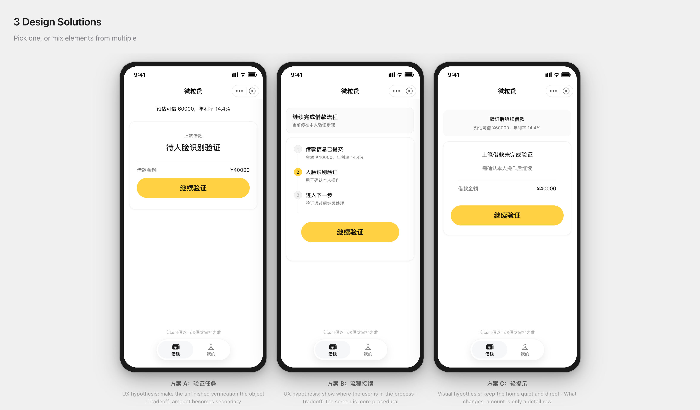
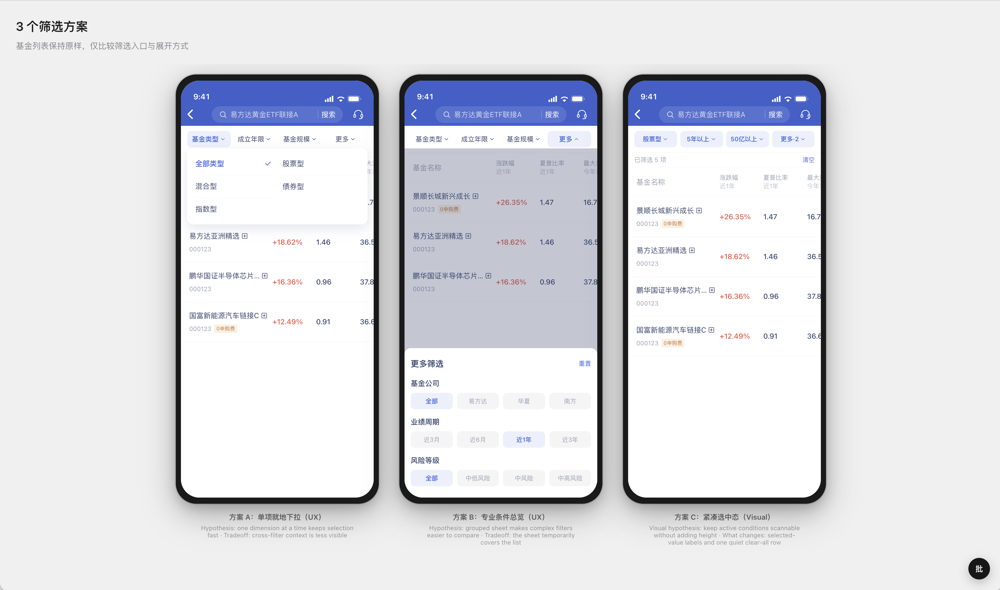

# Brainstorm 设计 Skill

用于移动端界面头脑风暴：澄清需求、生成并比较三种方向，并通过本地预览与点选批注持续迭代；选定方向后可推送 Figma 或交给产品档案声明的后续分支。

Skill 内置一份可直接运行的产品档案。项目根目录存在 `wld-design-profile/` 时优先使用该工作区档案，否则使用内置 `profile/`；一次运行始终只使用一份档案，不会混合两者。

## 效果预览

内置档案：



替换产品档案后：



## 目录结构

```text
brainstorm/
├── SKILL.md                 # Agent 执行的通用方法
├── agents/openai.yaml       # Skill 展示信息
├── assets/                  # 页面壳、预览样式、热更新与批注客户端
├── references/              # 方案发散方法与共享分支
├── scripts/                 # 预览、workflow、QA、遥测和验证
├── platforms/               # 平台预览外壳
└── profile/                 # 内置默认产品档案
```

三层边界：

- `profile/` 保存产品名、设计 token、组件、生产模板、产品规则、passes 和确定性工具。
- `platforms/` 只保存平台预览外壳；由档案的 `platform` 字段选择。
- 其余目录是产品、平台中立的共享机制。

## 工作方式

1. `scripts/serve-preview.cjs` 创建 `wld-design-brainstorms/<时间戳>-<run-label>/`，返回本次运行、档案诊断和预览 URL。
2. `scripts/workflow.mjs` 的 `prepare` 命令为当前 stage 生成隔离的 worker brief、分角色上下文与可编辑 fragments；任务事实和产品规则属于权威来源，完整生产页面语料作为只读设计参考。
3. Agent 只编辑 brief 声明的 fragments；`assemble` 使用 `assets/page-template.html` 确定性组装完整 HTML。
4. `validate` 检查页面壳、必需文案与资源、方案差异、CSS 变量、产品 QA、浏览器布局和截图。
5. 用户选择方案后，`select` 写入紧凑 handoff；Brainstorm 到此停止扩展页面或流程。
6. 用户可继续修改同一组三方案，或选择共享 Push to Figma 和产品档案声明的后续分支。

预览页右下角可开启点选批注。Agent 修改 fragments、重新组装和验证后，再通过 `scripts/acknowledge-annotations.cjs` 确认本轮实际读取的批注。

## 使用

把整个 `skills/brainstorm/` 目录复制到 Codex skills 目录，然后调用：

```text
$brainstorm 为当前移动端页面探索三种不同的信息层级方案
```

若项目需要自己的档案，使用同级 `setup-profile` Skill 创建或增量维护项目根目录的 `wld-design-profile/`。工作区档案存在但不完整时，预览服务会返回诊断并尽力运行；只有当前任务无法完成时，才显式使用 `--use-bundled-profile`。

## 开发与验证

在本目录运行：

```bash
bun run validate
bun run test
```

- `bun run validate` 检查自包含性、文档路径、模板清单、workflow contracts 和静态资源引用。
- `bun run test` 覆盖档案选择、run 目录、预览、批注、QA、workflow 和会话遥测。

手工编辑模板时，可在仓库根目录运行：

```bash
npm run screens:dev
```

## 更换内置产品档案

维护者需要完整替换内置档案时，按 [references/setup-profile.md](references/setup-profile.md) 执行。产品事实只进入 `profile/`：

1. 重写 `profile/PROFILE.md` 的 frontmatter、模板表、路由、设计语言、产品规则、passes 和分支表。
2. 替换 `profile/screens/` 的生产模板。
3. 替换 `profile/design-system/` 的 token、组件样式和图标。
4. 重写或删除 `profile/quality/` 中不属于新产品的规则、passes 和工具。
5. 运行完整验证，并通过真实预览检查 workflow 截图。

不要为换产品修改 `SKILL.md`、`scripts/`、`assets/` 或 `platforms/`；只有新产品暴露出通用缺陷时，才单独修共享机制。
